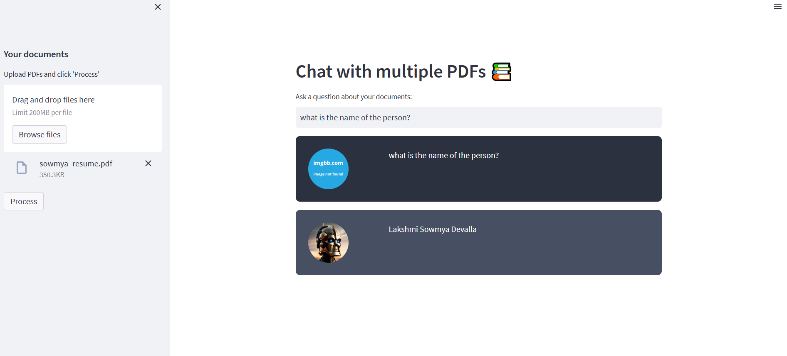

# MultiPDF Chat App


## Introduction
------------
The MultiPDF Chat App is a Python application that allows you to chat with multiple PDF documents. You can ask questions about the PDFs using natural language, and the application will provide relevant responses based on the content of the documents. This app utilizes a language model to generate accurate answers to your queries. Please note that the app will only respond to questions related to the loaded PDFs.

## How It Works
------------


The application follows these steps to provide responses to your questions:

1. PDF Loading: The app reads multiple PDF documents and extracts their text content.

2. Text Chunking: The extracted text is divided into smaller chunks that can be processed effectively.

3. Language Model: The application utilizes a language model to generate vector representations (embeddings) of the text chunks.

4. Similarity Matching: When you ask a question, the app compares it with the text chunks and identifies the most semantically similar ones.

5. Response Generation: The selected chunks are passed to the language model, which generates a response based on the relevant content of the PDFs.


## Models and APIs Used
The **MultiPDF Chat App** utilizes the following models and APIs to provide its functionality:

1. **Hugging Face Transformers**:
   - The application leverages models from the Hugging Face Transformers library, which provides a variety of pre-trained models for natural language processing tasks. These models can be used for tasks such as text extraction, summarization, and question answering.
   - You can choose from various models available on Hugging Face, such as BERT, DistilBERT, or GPT-2, depending on your specific needs for processing the PDF content.

2. **Free API Key**:
   - The application uses a free API key from Hugging Face to access their models. This allows the app to perform NLP tasks without incurring costs, making it accessible for educational and personal projects.
   - To use the models, you will need to sign up for a Hugging Face account and obtain your API key, which should be added to the `.env` file as follows:
     ```plaintext
     HUGGING_FACE_API_KEY=your_hugging_face_api_key
     ```

3. **PDF Processing Libraries**:
   - The app utilizes libraries such as `PyMuPDF` or `pdfminer.six` to extract text from PDF documents, enabling the application to read and process the content effectively.

## Dependencies and Installation
To install the MultiPDF Chat App, please follow these steps:

1. Clone the repository to your local machine:
   ```bash
   git clone https://github.com/Sowmyadevalla2005/Multipdf-chat-app.git
   ```

2. Navigate to the project directory:
   ```bash
   cd Multipdf-chat-app
   ```

3. Install the required dependencies by running the following command:
   ```bash
   pip install -r requirements.txt
   ```

4. Obtain an API key from Hugging Face and add it to the `.env` file in the project directory:
   ```plaintext
   HUGGING_FACE_API_KEY=your_hugging_face_api_key
   ```

## Usage
To use the MultiPDF Chat App, follow these steps:

1. Ensure that you have installed the required dependencies and added the Hugging Face API key to the `.env` file.
2. Run the `main.py` file using the Streamlit CLI. Execute the following command:
   ```bash
   streamlit run app.py
   ```

3. The application will launch in your default web browser, displaying the user interface.
4. Load multiple PDF documents into the app by following the provided instructions.
5. Ask questions in natural language about the loaded PDFs using the chat interface.

## Web Interface Looks Like:



## Contact
Your Name - [sowmya](mailto:sowmyad@gmail.com)
